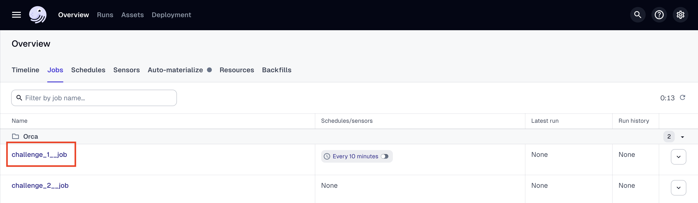
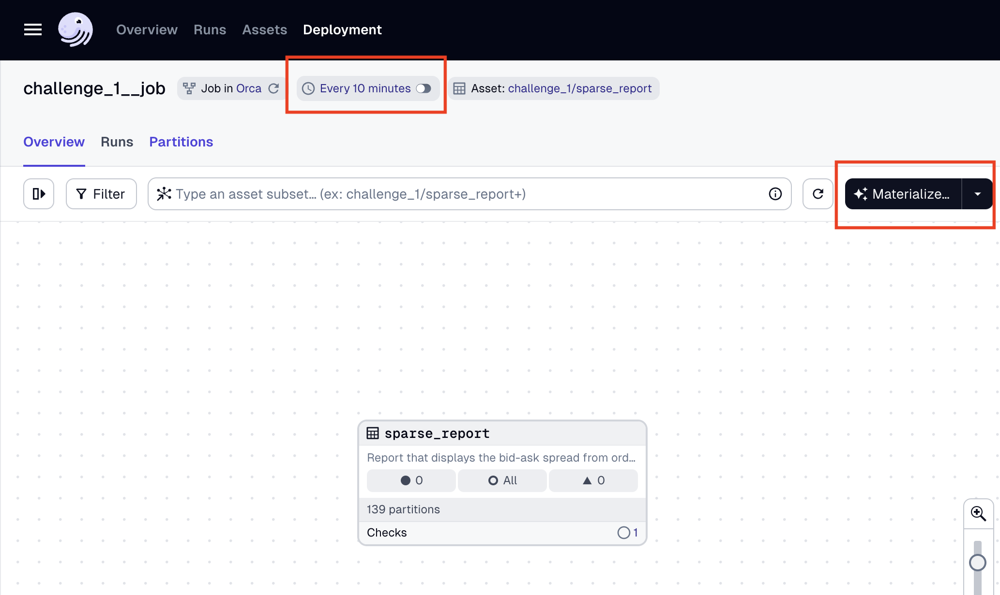

# DE Challenge 1

The following is a description on the components built to resolve challenge 1

## Hermes

Hermes is a CLI utility built to run a continuous stream from the Bitso API into a local file system. Once triggered it will query the API and dump its responses into a local folder using ndjson as format. It partitions the data into hourly batches to ensure direct access to events in a specific time frame. The expected output structure should look like the following:

```
~/Data/json_order_books/
    2024/
        01/
            01/
                24/batch_{timestamp}.json
            02/
                01/batch_{timestamp}.json
```


## Partition Justification

To replicate the storage within an S3 folder, I formatted the file storage with a `report_date=` prefix which can be used as hive partitioning. Each report date will contain at least 144 files with the name formatted as `%H%M`, this will give ease of access to further consumers.

## Spread Notifications

Spread is checked using asset checks, but this does not make the pipeline fail. Further development on webhooks should be made, but the Dagster UI will ensure that the data checks are displayed.

## ETL Workflow

Within Dagster's UI, the workflows are visible under `Overview > Jobs`:



From the job visualization, it can be scheduled or manually triggered using the materialize button. When prompted, it is recommended to only materialize an individual partition.



### Results Location

After execution of ETL workflows, all results will be located within the `$DATA_DIR/challenge_1` folder set in the `.env` file
