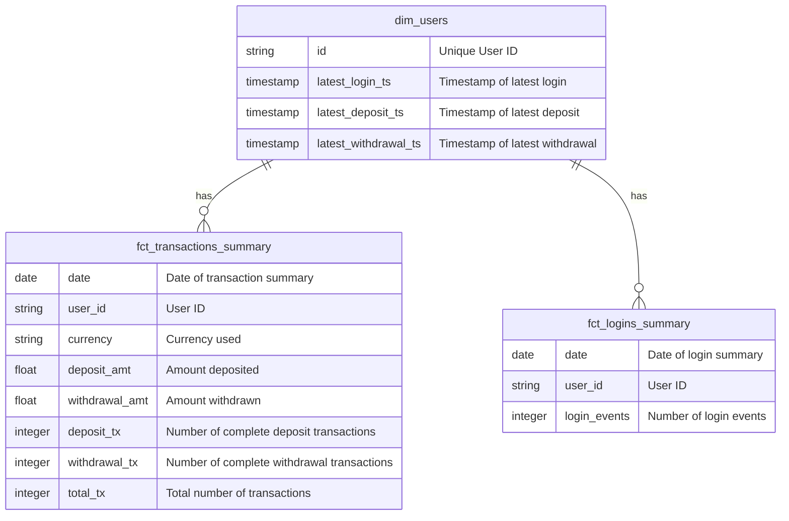
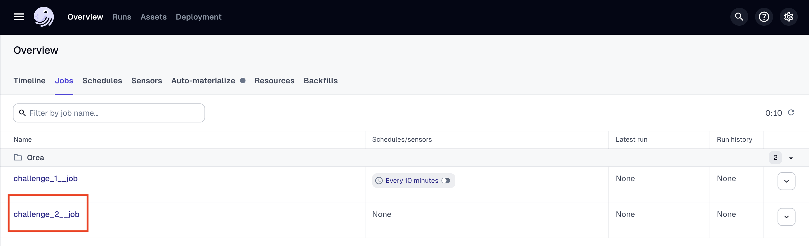
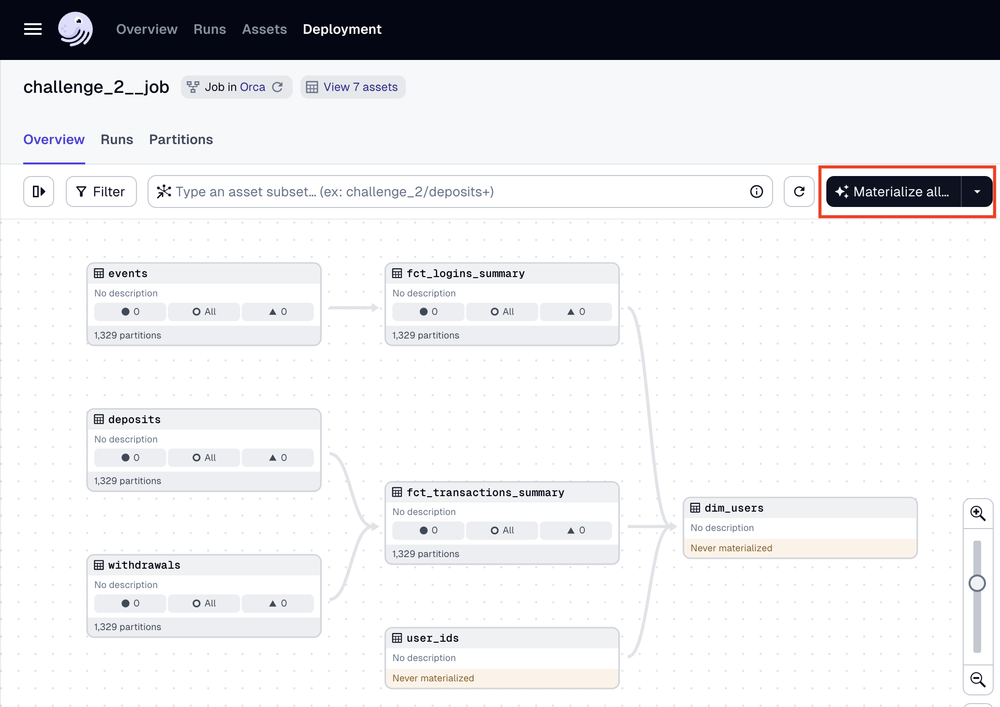

# DE Challenge 2

## Data Model

I used a star schema for modeling my warehouse to store all transactional information, which is common in the input data. Information was stored in summaries rather than full transactions to make consumption simpler, this does not mean that event granularity can not be supported.



The potential downsides of this model are:
  * **Addition of new columns**, caused by the aggregate outputs on the summary tables. One solution is to have an in-between data layer before summary delivery.

## Scenario Solutions
- How many users were active on a given day (they made a deposit or withdrawal)

```sql
select count(distinct user_id) active_users
from fct_transactions_summary
where date = {date}
```

- Identify users haven't made a deposit.

```sql
select user_id
from dim_users
where latest_deposit_ts is null
```

- Identify on a given day which users have made more than 5 deposits historically

```sql
with _rs as (
  select *,
    sum(deposit_tx) over (partition by user_id order by date) running_sum
  from fct_transactions_summary
  order by date
)
select distinct user_id
from _rs
where running_sum > 5 and date = {date}
```

- When was the last time a user made a login

```sql
select latest_login_ts
from dim_users
where user_id = {user_id}
```


- How many times a user has made a login between two dates

```sql
select user_id, sum(login_events)
from fct_logins_summary
where user_id = {user_id}
  and date between {start} and {end}
group by 1
```

- Number of unique currencies deposited on a given day

```sql
select distinct currency
from fct_transactions_summary
where date = {date}
  and deposit_tx > 0
```

- Number of unique currencies withdrew on a given day

```sql
select distinct currency
from fct_transactions_summary
where date = {date}
  and withdraw_tx > 0
```

- Total amount deposited of a given currency on a given day 

```sql
select sum(deposit_amt)
from fct_transactions_summary
where date = {date}
  and currency = {currency}
```

## ETL Workflow

Within Dagster's UI, the workflows are visible under `Overview > Jobs`:



From the job visualization, it can be manually triggered using the materialize button. When prompted, it is recommended to only materialize an individual partition. Since the source data for this job has a date limit, the implementation of schedules was out of scope.




### Results Location

All results should be located within the `$DATA_DIR/challenge_2` folder set in the `.env` file
